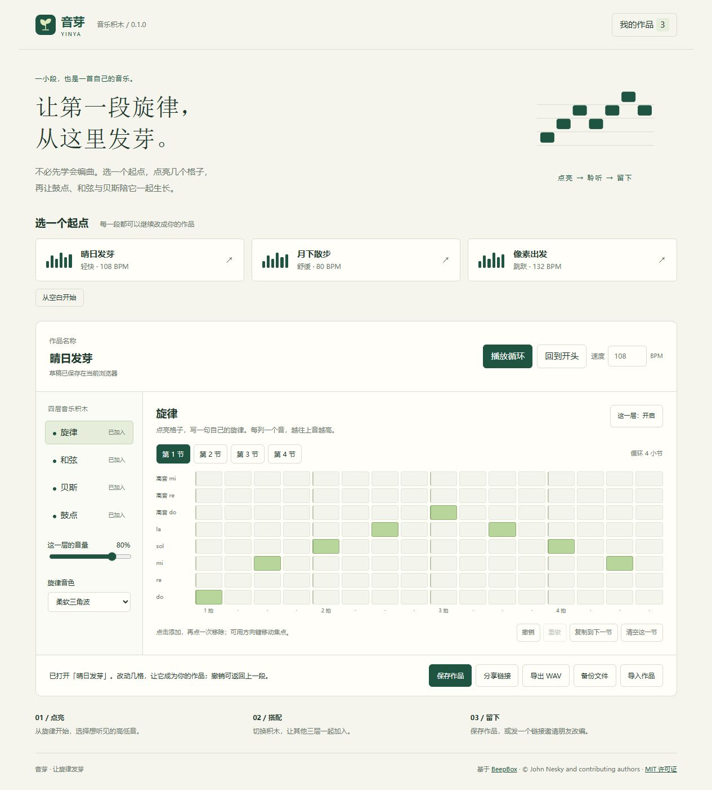
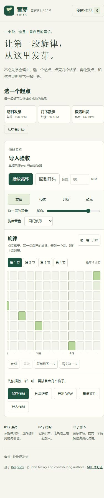

# 音芽 · v0.1.0

面向零基础用户的音乐积木。基于 BeepBox 的合成器，通过旋律、和弦、贝斯和鼓点四层音乐，创作一段自己的短曲。

## 这台电脑上使用

双击根目录的 `启动音芽.cmd`，打开 `http://127.0.0.1:9093/yinya/`。当前开发会话已在此地址运行。

1. 选择「晴日发芽」「月下散步」或「像素出发」，也可以从空白开始。
2. 按「播放循环」，切换四层积木，点网格添加或移除音符。
3. 选择四个小节中的任意一节继续修改；旋律和贝斯使用 C 大调五声音阶。
4. 调整速度、音量、音色与声部开关；修改可以撤销和重做。
5. 保存到「我的作品」，通过分享链接发送作品快照，或导出 WAV 和 JSON 备份。

「导出 WAV」完成后点击「下载音频」。四小节在 120 BPM 下为 8 秒，导出为 44.1 kHz、16 位立体声 PCM。

作品存在当前设备的当前浏览器中。草稿会自动保存，命名作品需按「保存作品」。清理浏览器数据会移除本地作品，建议保留 JSON 备份。通过「另存改编」或分享链接载入的作品，保存时创建新版本。

当前链接为本机预览地址；公开部署之后朋友才能从其他设备直接打开。音芽分享链接和 JSON 使用自己的 v1 作品格式，当前不直接导入 BeepBox 的历史链接或 JSON。

## 开发与检查

需要 Node.js 和 npm。音芽构建无需 Bash；上游原有脚本继续保留。

```powershell
npm ci --ignore-scripts
npm run build-yinya
npm run test-yinya
npm run start-yinya
```

如果本机 npm 默认缓存目录不可写，可以使用：

```powershell
npm ci --ignore-scripts --cache .npm-cache
```

构建入口 `scripts/build-yinya.mjs` 将界面、BeepBox 合成器及上游 WAV 渲染器打包到 `website/yinya/assets/app.js`。运行服务器仅绑定 `127.0.0.1`。可设置 `YINYA_PORT` 环境变量修改命令行服务器端口；双击启动器使用 9093。

- `yinya/model.js`：作品结构、原创起步作品、校验、分享编码和音频数据转换。
- `yinya/app.js`：中文编辑界面、本地存档、分享、导入导出与音频调度。
- `website/yinya/`：页面、样式、标识与许可证。
- `tests/`：作品数据及实际 BeepBox 音频引擎测试。
- `project-notes/release-v0.1.0.md`：功能、验收与当前限制。

桌面与手机预览：





## 上游与授权

上游：[johnnesky/beepbox](https://github.com/johnnesky/beepbox)。版权归 John Nesky 及贡献者，MIT 许可证保留于 `LICENSE.md`，页面也提供署名和许可证入口。

音芽首版的界面、品牌标识和三段起步作品为本次新增。声音通过合成生成，不使用外部歌曲或音频采样。暂未加入 MP3 导出，不会加载其额外编码依赖。
