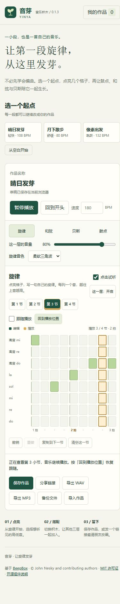

# 音芽 · v0.1.3

面向零基础用户的音乐积木。基于 BeepBox 的合成器，通过旋律、和弦、贝斯和鼓点四层音乐，创作一段自己的短曲。

## 开始创作

先按 [README](README.md) 安装并启动项目，再打开 `http://127.0.0.1:9093/yinya/`。Windows 安装依赖后可双击根目录的 `启动音芽.cmd`。命令行服务器也可通过 `YINYA_PORT` 指定其他端口。

1. 选择「晴日发芽」「月下散步」或「像素出发」，也可以从空白开始。
2. 暂停时点亮格子即可听见约 0.32 秒的短音，旋律/贝斯试听单音，和弦试听整组和声，鼓点试听对应鼓声。按「播放循环」可以听完整作品。
3. 播放时网格自动跟随当前小节；手动选择任意一节即可暂停跟随并继续修改。旋律和贝斯使用 C 大调五声音阶。
4. 调整速度、音量、音色与声部开关；修改可以撤销和重做。
5. 保存到「我的作品」，通过分享链接发送作品快照，或导出 MP3、WAV 和 JSON 备份。

「点击试听」开关在网格右上方，默认开启，设置只存在当前浏览器，刷新后仍生效。关闭后可安静编辑；删除音符、关闭声部或音量为零时不试听。循环播放中编辑直接改变音乐，避免额外声音叠加。快速点击切换到最新音，切换声部/小节、撤销重做、开始播放/导出和离开页面会取消未完成的试听。

「跟随播放」默认开启。小节按钮用绿色标记当前编辑小节，金色标记正在播放小节；网格同时高亮当前步和拍，显示播放进度。播放中手动选节会临时暂停跟随，音频继续循环；点击「回到播放位置」恢复跟随，不改变音频位置。暂停后重新播放会恢复临时停掉的跟随。主动关闭开关则会保存该偏好，刷新或再次播放仍保持关闭，点击试听偏好也继续保留。

「导出 MP3」完成后点击「下载 MP3」，获得 44.1 kHz、192 kbps 立体声文件；适合日常分享与播放。需要未压缩音频时，按「导出 WAV」后点击「下载 WAV」，获得 44.1 kHz、16 位立体声 PCM。

两种格式都导出当前作品的完整四小节。120 BPM 下音乐为 8 秒，MP3 因编码延迟和补齐会略长，验收文件约 8.046 秒。合成和编码均在浏览器本地完成，编码器随项目保存，不使用外部音频服务。导出时显示进度，也可按「取消导出」；取消或失败不会丢失作品。

作品存在当前设备、当前浏览器和当前网站地址下。改用其他域名或端口时，先导出 JSON 备份，再到新地址导入。草稿会自动保存，命名作品需按「保存作品」。清理浏览器数据会移除本地作品，建议保留 JSON 备份。通过「另存改编」或分享链接载入的作品，保存时创建新版本。

当前链接为本机预览地址；公开部署之后朋友才能从其他设备直接打开。音芽分享链接和 JSON 使用自己的 v1 作品格式，当前不直接导入 BeepBox 的历史链接或 JSON。

## 开发与检查

需要 Node.js 24 和 npm。音芽构建无需 Bash；上游原有脚本继续保留。

```powershell
npm ci --ignore-scripts
npm run build-yinya
npm run test-yinya
npm run start-yinya
```

如果 npm 默认缓存目录不可写，可以在项目中指定临时缓存目录：

```powershell
npm ci --ignore-scripts --cache .npm-cache
```

构建入口 `scripts/build-yinya.mjs` 将界面、BeepBox 合成器及上游 WAV 渲染器打包到 `website/yinya/assets/app.js`。同时生成独立的 MP3 Worker（`assets/mp3-worker.js`），运行时引用原样保存的 `vendor/lamejs.js`。运行服务器仅绑定 `127.0.0.1`。可设置 `YINYA_PORT` 环境变量修改命令行服务器端口；双击启动器使用 9093。

- `yinya/model.js`：作品结构、原创起步作品、校验、分享编码和音频数据转换。
- `yinya/app.js`：中文编辑界面、本地存档、分享、导入导出与音频调度。
- `yinya/mp3.js`、`mp3-worker.js`：PCM 到 MP3 的适配及后台编码。
- `website/yinya/`：页面、样式、标识、独立编码器与许可证。
- `yinya/preview.js`：使用实际 BeepBox 音色合成短音、管理 Web Audio 播放与取消。
- `yinya/playback.js`：播放进度与自动跟随视图状态，不修改音乐或跳转音频。
- `tests/`：作品数据、实际 BeepBox 音频引擎、试听、跟随与独立 MP3 解码测试（20 项）。
- `scripts/package-yinya.mjs`：生成仅含音芽运行文件与许可证的静态网站包。
- `.github/workflows/yinya-ci.yml`：Linux / Windows 的安装、测试、构建和网站包检查。
- [部署说明](docs/DEPLOYMENT.md)：静态网站包及部署验收。
- [版本变化](CHANGELOG.md)：已完成的功能。

桌面与手机预览：




## 上游与授权

上游：[johnnesky/beepbox](https://github.com/johnnesky/beepbox)。版权归 John Nesky 及贡献者，MIT 许可证保留于 `LICENSE.md`，页面也提供署名和许可证入口。

音芽首版的界面、品牌标识和三段起步作品为本次新增。声音通过合成生成，不使用外部歌曲或音频采样。MP3 使用独立的 LGPL-3.0 编码器，仅在导出时加载，保留原样模块及完整许可证。详情见 [第三方组件说明](THIRD_PARTY_NOTICES.md)；页面底部也提供「开源组件说明」入口。

作品的 v1 数据格式及本地存储键保持兼容，0.1.0 / 0.1.1 / 0.1.2 的草稿、作品库、分享链接和 JSON 备份可继续使用。
